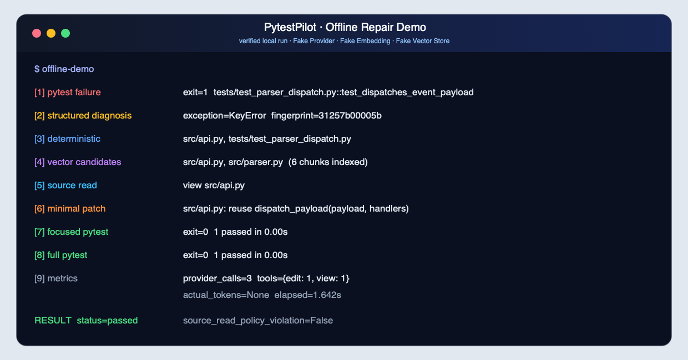
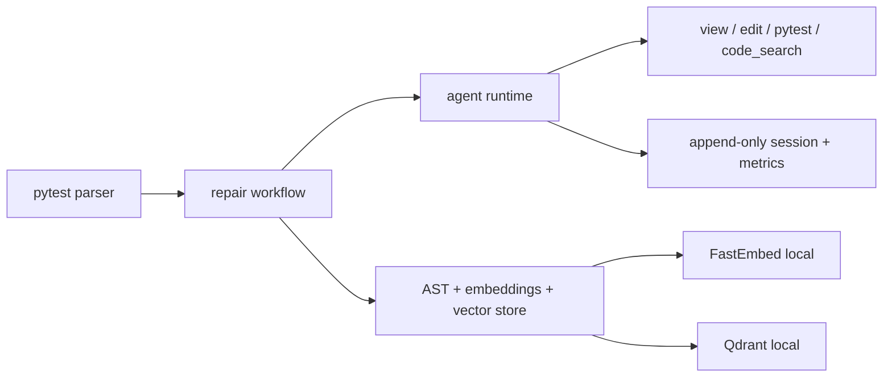

<p align="center">
  
</p>

<h1 align="center">PytestPilot</h1>

<p align="center">
  <strong>面向 Python/pytest CI 失败诊断与自动修复的可观测 Coding Agent。</strong>
</p>

<p align="center">
  <a href="https://github.com/godkunzzz3/PytestPilot/actions/workflows/ci.yml"></a>
  
  
  <a href="LICENSE"></a>
</p>

PytestPilot 把 pytest 失败日志转成结构化证据，结合确定性定位与可选的本地语义检索，驱动 Agent 在读取真实源码后做最小修改，再以 focused/full pytest 双阶段验收。每次运行都可记录 Provider、Tool、Token、成本、Diff、Context 与耗时指标。

```text
pytest failure → structured diagnosis → deterministic/vector candidates
→ source read → minimal patch → focused pytest → full pytest → metrics
```

<p align="center">
  
</p>

上图来自真实本地离线运行：Fake Provider、Fake Embedding 和 Fake Vector Store 完成了 `view → edit → focused pytest → full pytest`，没有访问外部模型或网络服务。

PytestPilot 基于 [FirstCoder](https://github.com/KomorGiaoGiao/FirstCoder) 二次开发，保留上游 MIT License 与原作者版权；归属详情见 [NOTICE.md](NOTICE.md)。

## 核心能力

- pytest 文本日志结构化解析：失败 node id、异常/Assertion、源码位置与稳定 Fingerprint；
- 有界 pytest 修复 Workflow：最多两次尝试，focused/full-test 双阶段验证；
- Python AST 代码切分、content hash 与增量索引；
- FastEmbed + Qdrant local 持久化语义检索及 `code_search` Tool；
- 路径级 Source Read Policy：向量结果只生成候选，修改前必须重新读取当前源码；
- 9 个离线、可复现的 pytest Benchmark，固定题目、命令、editable paths 与判分标准；
- Provider/Tool/Token/成本/Diff/Context 指标，缺失 actual usage 时保持 `null`；
- DeepSeek Flash OpenAI-compatible 接入、SDK 零重试与请求级预算预留；
- 上游 Agent Loop、权限、append-only Session、Context Compaction 与本地 TUI。

## 快速开始

需要 Python 3.11 或更高版本。克隆后先运行完全离线的开发测试：

```sh
git clone https://github.com/godkunzzz3/PytestPilot.git
cd PytestPilot
python -m venv .venv
.venv/bin/python -m pip install -e ".[dev]"
.venv/bin/python -m pytest tests -q
```

本地语义检索是可选能力；安装后可建立 Qdrant local 索引：

```sh
.venv/bin/python -m pip install -e ".[dev,retrieval]"
.venv/bin/firstcoder index build --project .
.venv/bin/firstcoder index status --project .
```

模型与凭证配置完成后，运行 pytest 修复闭环：

```sh
.venv/bin/firstcoder pytest-fix \
  --project /path/to/python-project \
  --test-command "python -m pytest -q" \
  --json-out runs/pytest-fix-result.json
```

`pytest-fix` 默认最多执行两次修复尝试，不重试 Provider 请求。Qdrant 不可用时，Parser 与确定性候选仍会继续工作。

## 离线验证

单元测试和集成测试使用 Fake Provider；CI 安装 `.[dev,retrieval]` 以运行临时 Qdrant local 持久化测试，但不启用 FastEmbed 模型集成门禁，因此不会下载模型或发起真实 Provider 请求。

```sh
# Fake Provider 修复闭环
.venv/bin/python -m pytest tests/test_pytest_fix_workflow.py -q

# Parser、Retrieval、Benchmark 与指标
.venv/bin/python -m pytest \
  tests/test_ci_pytest_parser.py \
  tests/test_retrieval.py \
  tests/test_code_search_tool.py \
  tests/test_local_pytest_benchmark.py \
  tests/test_eval_adapter.py -q
```

当前本地完整验证结果为 **891 passed、2 skipped、0 failed**。GitHub Actions 在 Python 3.12 和 3.14 上运行同一条 `python -m pytest tests -q` 命令。

## Benchmark 与诚实边界

### 9 题真实 Agent Benchmark

首次真实实验得到：

| 配置 | 通过率 |
| --- | ---: |
| Deterministic baseline | 7/9 |
| Vector-enabled | 8/9 |

该轮 Vector 运行没有实际调用 `code_search`，因此 8/9 与 7/9 的差异不能归因于向量检索。

### 离线检索验证

两个 `retrieval_required` 语义任务使用本地 FastEmbed 与 Qdrant 重跑：Vector Relevant File Hit@5 为 **2/2**；deterministic baseline 为 **1/2**。这是候选检索结果，不是修复成功率。

### 受控语义任务配对实验

两个语义任务分别执行 3 次 Baseline 和 3 次 Vector，共 12 次纳入比较的真实 Agent 运行：

| 指标 | Baseline | Vector |
| --- | ---: | ---: |
| 通过率 | 6/6 | 6/6 |
| Input Tokens | 230,474 | 291,460 |
| Output Tokens | 4,454 | 6,124 |
| Provider Calls | 38 | 44 |
| Tool Calls | 32 | 50 |
| 平均耗时 | 11.94s | 14.05s |
| 保守估算成本 | $0.0335 | $0.0425 |

Vector 组 6 次合规运行均实际调用 `code_search`，Relevant File Hit@5 为 6/6，并完成 `code_search → source read → edit → pytest`。两组通过率相同，且 Vector 使用了更多 Token、工具调用与时间；这验证了语义检索链路可执行，尚不能证明它提升修复通过率。

完整实验配置、排除项与成本对账见 [DeepSeek Benchmark 审计报告](docs/DEEPSEEK_BENCHMARK_AUDIT.md)。

## Provider 与预算

DeepSeek preset 使用官方 OpenAI-compatible endpoint，模型为 `deepseek-v4-flash`，默认 thinking disabled、temperature 0、最大输出 4096，并关闭 OpenAI SDK retry。凭证只从 `DEEPSEEK_API_KEY` 环境变量读取。

当前主线面向 OpenAI Chat Completions-compatible Provider，支持 OpenAI-compatible 流式响应、Tool Calling、usage 标准化和有界 `PROMPT_TOO_LONG` 恢复；不声称支持 OpenAI Responses API、Provider-specific reasoning 或多模态输入。Anthropic adapter 仍是实验性实现，当前不提供 Anthropic 原生 thinking/cache/streaming 行为。

受审计 Benchmark 在每次请求前估算输入、应用 1.20 安全系数、按最大输出预留预算，并在 usage 返回后对账；usage 缺失会停止后续请求。该机制降低超支风险，但不能保证供应商最终账单。Thinking-mode Tool Calling 与 `reasoning_content` 回传尚未实现。

真实模型命令只应在明确确认凭证、额度与预算后运行。日常开发、CI 和本 README 中的离线验证均不需要 API Key。

## 架构边界



核心不变量：原始 Session 事实 append-only；Context Compaction 只改变 Provider 投影；向量索引副本不能直接作为编辑依据；Qdrant 不可用时确定性路径 fail-open；actual token 与 estimated token 分开记录。

## 当前范围

当前只支持 Python 仓库、pytest 文本日志和本地索引。暂不包含多 Agent、多语言、reranker、云 Qdrant、Thinking-mode Tool Calling、完整 FreshSourceGuard 或大规模 SWE-bench。项目不声称向量检索已提升修复成功率。

## 项目来源

PytestPilot 基于开源项目 [FirstCoder](https://github.com/KomorGiaoGiao/FirstCoder) 进行二次开发。上游项目提供 Agent Loop、工具系统、权限控制、Session、Context Compaction 和本地 TUI 等基础运行时。

本项目主要新增 pytest 失败解析与修复 Workflow、AST/FastEmbed/Qdrant 检索、`code_search`、Source Read Policy、9 题 Benchmark、完整指标、DeepSeek Flash 接入、请求预算及受控配对实验。

原项目的 MIT License 和版权声明予以保留，详见 [LICENSE](LICENSE) 与 [NOTICE.md](NOTICE.md)。

## 文档

- [pytest 修复演示手册](docs/PYTEST_FIX_DEMO_RUNBOOK.md)
- [DeepSeek Benchmark 审计报告](docs/DEEPSEEK_BENCHMARK_AUDIT.md)
- [一周 MVP 范围与验收](docs/MVP_GOAL.md)
- [技术文档索引](docs/README.md)
- [中文文档索引](docs/README.zh-CN.md)
- [代码库阅读指南](docs/CODEBASE_READING_GUIDE.md)

## License

本项目沿用上游 [MIT License](LICENSE)。衍生项目归属与修改版权说明见 [NOTICE.md](NOTICE.md)。
