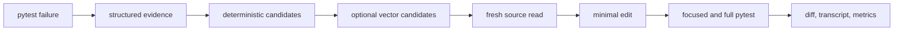

<p align="center">
  
</p>

<h1 align="center">PytestPilot</h1>

<p align="center">
  <strong>面向 Python/pytest CI 失败诊断与自动修复的可观测 Coding Agent。</strong>
</p>

<p align="center">
  <a href="#quickstart"></a>
  <a href="#tui"></a>
  <a href="#configuration"></a>
  <a href="#development"></a>
  <a href="https://deepwiki.com/KomorGiaoGiao/FirstCoder"></a>
</p>

<p align="center">
  English
  · <a href="README.zh-CN.md">简体中文</a>
</p>

---

## 项目来源

PytestPilot 基于开源项目
[FirstCoder](https://github.com/KomorGiaoGiao/FirstCoder)
进行二次开发。

上游项目提供 Agent Loop、工具系统、权限控制、Session、
Context Compaction 和本地 TUI 等基础运行时。

本项目主要新增：

- Python/pytest 失败日志结构化解析与稳定 Fingerprint；
- pytest CI 自动诊断与修复 Workflow；
- Python AST 代码切分与增量索引；
- FastEmbed + Qdrant 本地代码语义检索；
- `code_search` Tool；
- 路径级 Source Read Policy；
- 9 个可复现 pytest Benchmark；
- Provider、Tool、Token、成本、Diff 和 Context 指标；
- DeepSeek Flash 接入、SDK 零重试和请求级预算控制；
- 受控 Baseline/Vector 配对实验。

原项目的 MIT License 和版权声明予以保留，详见 [LICENSE](LICENSE) 和 [NOTICE.md](NOTICE.md)。

## 实验结果

### 9 题真实 Agent Benchmark

首次真实实验：

| 配置 | 通过率 |
|---|---:|
| Deterministic baseline | 7/9 |
| Vector-enabled | 8/9 |

该轮 Vector 运行未实际调用 `code_search`，因此两组差异不能归因于向量检索。

### 受控语义任务配对实验

对两个 `retrieval_required` 语义任务分别执行 3 次 Baseline 和
3 次 Vector，共 12 次纳入比较的真实 Agent 运行。

| 指标 | Baseline | Vector |
|---|---:|---:|
| 通过率 | 6/6 | 6/6 |
| Input Tokens | 230,474 | 291,460 |
| Output Tokens | 4,454 | 6,124 |
| Provider Calls | 38 | 44 |
| Tool Calls | 32 | 50 |
| 平均耗时 | 11.94s | 14.05s |
| 保守估算成本 | $0.0335 | $0.0425 |

Vector 组 6 次纳入比较的运行均实际调用 `code_search`，Relevant File Hit@5 为 6/6，
并完成 `code_search → source read → edit → pytest` 链路。

当前小样本中两组通过率相同，Vector 增加了 Token、工具调用和运行时间。
该实验验证了语义检索链路的可执行性，尚不能证明其提升修复通过率。两次初始
Vector 运行因未调用 `code_search` 被审计器排除，并在策略加固后透明补跑；完整过程见
[DeepSeek Benchmark 审计报告](docs/DEEPSEEK_BENCHMARK_AUDIT.md)。

FirstCoder is a real, runnable local coding agent with a Textual TUI, tool calling, permissions, sessions, and context compaction. It is designed to be useful in daily work and easy to study in code.

If you want to understand how coding agents actually work, FirstCoder keeps the moving parts visible instead of hiding them behind a black box.

- Learn the agent loop, tool calling, permissions, sessions, and context handling.
- Build on a small Python codebase with clear module boundaries.
- Use a local coding agent while still being able to inspect how it works.


## Why FirstCoder

Most coding-agent demos show the surface: a prompt goes in, code changes come out. FirstCoder focuses on the machinery in between.

Compared with larger projects like OpenCode, FirstCoder is intentionally smaller in scope.

| Dimension | FirstCoder | Larger projects like OpenCode |
| --- | --- | --- |
| Primary goal | Make agent internals readable and teachable | Deliver a broader production-style coding-agent platform |
| Codebase shape | Roughly 17k lines of Python runtime code in this repo | Roughly 575k lines of TS/JS across a much larger multi-surface codebase |
| Engineering tradeoff | Drops some extra platform surface area to stay inspectable | Accepts more complexity to support a broader product surface |
| Best fit | Learning, modification, interview prep, portfolio projects, and local experimentation | Users who want a larger, more full-surface coding-agent environment |

The goal is not to out-feature a bigger coding agent. The goal is to keep the system real enough to use, but small enough that you can still read it end to end and understand why each subsystem exists.

That also makes FirstCoder a practical repo to study deeply, adapt for your own workflow, and turn into a resume-worthy or portfolio-friendly project after you have extended it.

Compared with more tutorial-first or lightweight learning repos, FirstCoder also tries to stay closer to a small but testable engineering system.

| Dimension | FirstCoder | Many learning-oriented agent repos |
| --- | --- | --- |
| Learning value | Readable subsystem boundaries and explicit docs | Often optimized for a single tutorial path or demo flow |
| Practical surface | Real TUI, tools, permissions, sessions, provider adapters | Often focused on a narrower loop or a simpler proof of concept |
| Verification | 80+ test files and multiple benchmark entry points | Often lighter on testing and benchmark integration |
| Extension path | Easier to adapt into a portfolio or resume project | Often better for following along than for long-term extension |

In this repo, the learning goal is important, but it is paired with enough runtime structure, tests, and benchmark hooks to make the project useful after the first read-through.

It is built for people who want to:

- study how a coding agent is assembled
- modify or extend a local Python implementation
- understand the architecture well enough to explain it in an interview

Detailed subsystem design lives in the docs, not in this README.

## Quickstart

Install with `pipx`:

```sh
pipx install firstcoder
```

Start the TUI:

```sh
firstcoder
```

Run one message without opening the TUI:

```sh
firstcoder --message "Summarize this repository in one paragraph"
```

Use line-oriented interactive mode:

```sh
firstcoder --interactive
```

## What You Get

- Local Python coding agent
- Textual TUI that exposes agent activity instead of hiding it
- Tool calling with permission checks before risky actions
- Session persistence, resume flow, and context compaction
- Skills, provider adapters, and clean modules for study and modification

## Configuration

Create a starter config:

```sh
firstcoder config init
firstcoder config path
firstcoder config show
```

Keep secrets in environment variables:

```sh
export FIRSTCODER_API_KEY="your-api-key"
```

Default config locations:

```text
global:  ~/.config/firstcoder/config.toml
project: ./firstcoder.toml
```

### Provider Scope

The current mainline targets OpenAI Chat Completions-compatible providers. It supports OpenAI-compatible 流式 responses, tool calling, usage normalization, and bounded `PROMPT_TOO_LONG` recovery. This scope does not claim support for the OpenAI Responses API, provider-specific reasoning, or 多模态 input.

The Anthropic adapter is 实验性 and does not currently provide Anthropic 原生 thinking/cache/streaming behavior.

## TUI

FirstCoder's TUI is designed to expose the agent loop instead of hiding it. You can see session state, streamed assistant output, tool calls, tool results, and permission prompts in one place.

Empty session:


Tool calls appear in the conversation flow:


Permission requests pause the agent until the user decides:


## Documentation

- [Technical Docs Index](docs/README.md)
- [Chinese Docs Index](docs/README.zh-CN.md)
- [Codebase Reading Guide](docs/CODEBASE_READING_GUIDE.md)

## Development

Install dev dependencies:

```sh
python -m venv .venv
.venv/bin/python -m pip install -e ".[dev]"
```

Run all tests:

```sh
.venv/bin/python -m pytest
```

Run a focused test file:

```sh
.venv/bin/python -m pytest tests/test_app_tui.py -q
```

## Python/pytest Repair MVP

The current MVP specializes FirstCoder for local Python/pytest failure repair. The flow is:



Install the optional local-retrieval dependencies, then build the persistent index:

```sh
.venv/bin/python -m pip install -e ".[dev,retrieval]"
.venv/bin/firstcoder index build --project .
.venv/bin/firstcoder index status --project .
# Use this after changing the embedding model or dimension:
.venv/bin/firstcoder index rebuild --project .
```

Run the repair workflow after configuring an available provider:

```sh
.venv/bin/firstcoder pytest-fix \
  --project . \
  --test-command ".venv/bin/python -m pytest tests/test_example.py -q" \
  --json-out runs/pytest-fix-result.json
```

The command performs at most two repair attempts by default and never retries a Provider request. If a local index is unavailable, structured pytest parsing and deterministic source candidates continue to work. Vector results are candidates only; the agent must read current source before editing it.

The DeepSeek preset uses the official OpenAI-compatible endpoint, reads credentials only from `DEEPSEEK_API_KEY`, and defaults to `deepseek-v4-flash` with thinking disabled, temperature 0, a 4096-token output cap, and OpenAI SDK retries disabled. Thinking-mode tool calling and `reasoning_content` round-trip are intentionally deferred.

The audited DeepSeek benchmark path adds a shared request-boundary budget: before each request it estimates prompt tokens, applies a 1.20 safety factor, reserves the configured maximum output, and charges all input at the cache-miss rate. Actual usage is reconciled after the response; missing usage stops later requests. This reduces overspend risk but cannot guarantee the provider's final invoice. Benchmark sessions load no global skills, exclude `ask_user`, require exact source reads before edits, and require `code_search → view/read_multi` for retrieval-required Vector tasks.

The reproducible benchmark contains nine tasks. Its evaluator confirms the initial failure, rejects test edits and out-of-scope writes, and records Provider/Tool counts, actual usage (or `null`), estimated input tokens, context/archive metrics, elapsed time, final diff, and transcript path. Offline tests use Fake Provider, Fake Embedding, and Fake Vector Store:

```sh
.venv/bin/python -m pytest \
  tests/test_local_pytest_benchmark.py \
  tests/test_eval_adapter.py \
  tests/test_ci_pytest_parser.py \
  tests/test_retrieval.py \
  tests/test_pytest_fix_workflow.py -q
```

The 2026-07-14 controlled two-task sample produced 6/6 Baseline and 6/6 policy-compliant Vector passes. Vector made six actual `code_search` calls and re-read candidates, but the equal pass rates do not show an accuracy improvement; Vector used more tokens and time in this tiny sample. Two initial Vector runs that skipped `code_search` were excluded and transparently rerun after the policy gate was enforced. Total new conservative cost, including Smoke and excluded runs, was `$0.08710954` under the `$0.25` limit.

See [the DeepSeek benchmark audit](docs/DEEPSEEK_BENCHMARK_AUDIT.md), [the demo runbook](docs/PYTEST_FIX_DEMO_RUNBOOK.md), and [the one-week MVP scope](docs/MVP_GOAL.md). Do not run a model-backed benchmark without explicit quota authorization and the request-budget wrapper; the test suite does not make real Provider requests.

## Philosophy

FirstCoder was built to answer a question most coding agents do not address:

> What actually happens inside when an agent streams, calls tools, asks for
> permission, compacts context, and resumes a session?

It is a real runnable agent, but it is also a readable Python project you can learn from one subsystem at a time.
