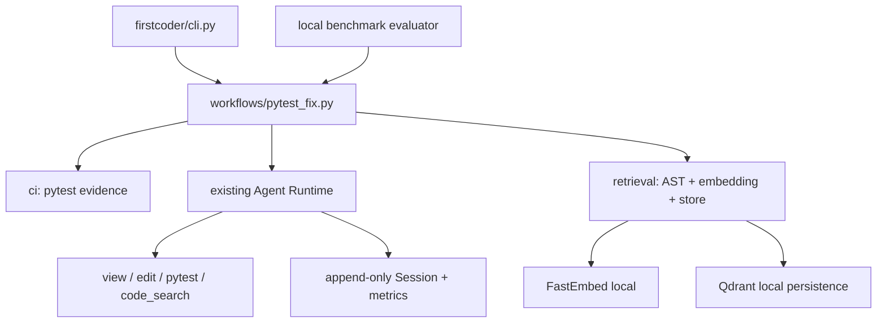

# FirstCoder pytest 修复 MVP 演示手册

本手册用于 5–8 分钟的本地演示。演示环境只支持 Python/pytest；向量检索使用 FastEmbed 和 Qdrant local。百炼额度未恢复时，只演示离线组件和 Fake Provider 测试，不执行真实模型命令。

## 架构边界



关键不变量：原始 Session 事实 append-only；向量结果只生成候选；编辑前必须读取当前源码；Qdrant 不可用时 Parser、路径、文本和 symbol 检索仍可工作；actual token 缺失时为 `null`，不能用 estimated 冒充。

## 1. 环境检查（约 30 秒）

```sh
pwd
git branch --show-current
.venv/bin/python --version
.venv/bin/python -m pip show qdrant-client fastembed
```

推荐 Python 3.11+。本地验证环境为 Python 3.14.0。安装命令：

```sh
.venv/bin/python -m pip install -e ".[dev,retrieval]"
```

FastEmbed 默认缓存目录是 `~/Library/Caches/firstcoder/fastembed`，可用 `FIRSTCODER_FASTEMBED_CACHE` 覆盖。首次下载模型需要网络；本项目测试使用 Fake Embedding，不依赖下载。

## 2. 展示 Parser（约 45 秒）

```sh
.venv/bin/python -m pytest tests/test_ci_pytest_parser.py -q
```

说明输出模型包含失败 node id、phase、exception/assertion、expected/actual、源码位置和稳定 fingerprint，并覆盖 ANSI、截断日志、collection/import error、setup/teardown、参数化与 Windows 路径。

## 3. 构建与查询本地索引（约 90 秒）

```sh
.venv/bin/python -m firstcoder.cli index build --project .
.venv/bin/python -m firstcoder.cli index status --project .
```

文件变化后再次 `build` 会增量更新；模型或维度变化时执行：

```sh
.venv/bin/python -m firstcoder.cli index rebuild --project .
```

`code_search` 返回路径、symbol、行号、score、content hash 和有界预览。索引中的副本不能直接作为编辑依据。

## 4. 展示 Fake Provider 修复闭环（约 90 秒）

```sh
.venv/bin/python -m pytest \
  tests/test_pytest_fix_workflow.py \
  tests/test_cli.py -q
```

测试中的 Fake Provider 真实驱动 AgentLoop 完成 source view、edit、focused pytest 和 full pytest，并验证最多两次修复尝试、JSON 输出、diff/metrics 和 mutation-before-read 检查。它不会访问任何外部 Provider。

## 5. 展示 Benchmark（约 90 秒）

```sh
.venv/bin/python -m pytest \
  tests/test_local_pytest_benchmark.py \
  tests/test_eval_adapter.py -q
```

题库位于 `benchmark/local_pytest/tasks.sample.jsonl`，包含 9 个固定任务：4 个以上单文件、3 个以上多文件、2 个语义定位题和 1 个 focused/full regression 题。相同任务与 pytest 命令用于 baseline/vector 对比。判分要求初始测试失败、最终测试通过、测试文件未改、写入未越过 `editable_paths`。

Summary 的核心字段包括：

- `provider_call_count`、`tool_call_count`、`tool_calls_by_name`；
- `actual_input_tokens`、`actual_output_tokens`、`actual_total_tokens`（不可得时为 `null`）；
- `estimated_input_tokens`（独立字段）；
- `elapsed_seconds`、compaction/archive/source-read metrics；
- `initial_failure_confirmed`、`test_file_modified`、`out_of_scope_write`；
- `final_diff`、diff stats、`transcript_path`、`relevant_file_hit_at_5`。

## 6. 已验证数据与诚实边界（约 45 秒）

2026-07-14 使用缓存 FastEmbed 与临时 Qdrant 的离线结果：

| Task | Baseline Hit@5 | Vector Hit@5 | Index | Query |
| --- | ---: | ---: | ---: | ---: |
| `service_repository_contract` | true | true | 0.033658s | 0.006848s |
| `parser_dispatch` | false | true | 0.038659s | 0.003597s |

这是候选检索准确性，不是模型修复通过率。因百炼/Qwen 免费额度耗尽，真实 Smoke Test、真实模型 Benchmark、真实 token usage 和 baseline/vector 模型 pass rate 均未获得。

## 7. 额度恢复后的命令

先由用户明确确认额度恢复，再做 1 个 Smoke Task、3 个小任务，稳定后才运行完整 9 题。命令会使用现有 Provider 配置，不应复制或打印 API Key：

```sh
.venv/bin/python -m firstcoder.cli pytest-fix \
  --project /path/to/python-repo \
  --test-command "python -m pytest -q --tb=short" \
  --json-out runs/pytest-fix-result.json

.venv/bin/python benchmark/local_pytest/runner.py \
  --workdir runs/local-pytest-baseline \
  --summary-out runs/local-pytest-baseline.json \
  --retrieval-mode baseline \
  --max-tasks 1
```

确认小任务稳定后，将 `--retrieval-mode` 改为 `vector` 并对相同题集运行；不得改题或改判分命令。当前 CLI 将 Provider retry 固定为 0。

## 已知限制

- 仅支持 Python、pytest 文本日志和本地仓库。
- 没有多 Agent、多语言、reranker、云 Qdrant、专用 TUI 或新 Trace 子系统。
- `pytest-fix` 的语义 Tool 只在本地索引存在且可打开时注入；否则 fail-open 到确定性路径。
- mutation-before-read 当前是工作流完成后的策略检查，不是新的全局 FreshSourceGuard。
- 默认模型 Benchmark 是真实 Provider 路径；额度未恢复时不要运行。

## 失败记录模板

```text
命令：
退出码：
通过/失败数量：
失败测试：
错误原因：
Provider 调用次数（应为 0 或 Fake）：
是否修改测试/越权写入：
git diff --stat：
下一步：
```
