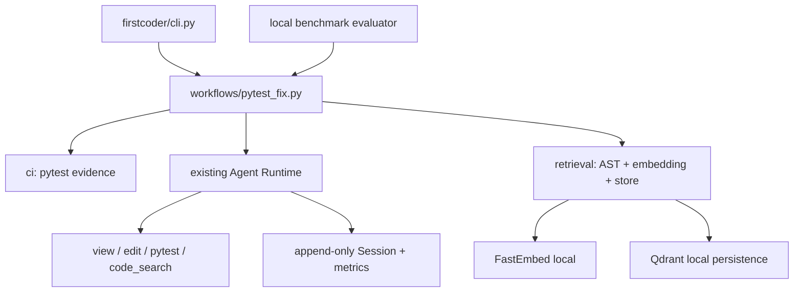

# FirstCoder pytest 修复 MVP 演示手册

本手册用于 5–8 分钟的本地演示。演示环境只支持 Python/pytest；向量检索使用 FastEmbed 和 Qdrant local。百炼额度未恢复时，只演示离线组件和 Fake Provider 测试，不执行真实模型命令。

## 架构边界



关键不变量：原始 Session 事实 append-only；向量结果只生成候选；编辑前必须读取当前源码；Qdrant 不可用时 Parser、路径、文本和 symbol 检索仍可工作；actual token 缺失时为 `null`，不能用 estimated 冒充。

## 1. 环境检查（约 30 秒）

```sh
pwd
git branch --show-current
.venv/bin/python --version
.venv/bin/python -m pip show qdrant-client fastembed
```

推荐 Python 3.11+。本地验证环境为 Python 3.14.0。安装命令：

```sh
.venv/bin/python -m pip install -e ".[dev,retrieval]"
```

FastEmbed 默认缓存目录是 `~/Library/Caches/firstcoder/fastembed`，可用 `FIRSTCODER_FASTEMBED_CACHE` 覆盖。首次下载模型需要网络；本项目测试使用 Fake Embedding，不依赖下载。

## 2. 展示 Parser（约 45 秒）

```sh
.venv/bin/python -m pytest tests/test_ci_pytest_parser.py -q
```

说明输出模型包含失败 node id、phase、exception/assertion、expected/actual、源码位置和稳定 fingerprint，并覆盖 ANSI、截断日志、collection/import error、setup/teardown、参数化与 Windows 路径。

## 3. 构建与查询本地索引（约 90 秒）

```sh
.venv/bin/firstcoder index build --project .
.venv/bin/firstcoder index status --project .
```

文件变化后再次 `build` 会增量更新；模型或维度变化时执行：

```sh
.venv/bin/firstcoder index rebuild --project .
```

`code_search` 返回路径、symbol、行号、score、content hash 和有界预览。索引中的副本不能直接作为编辑依据。

## 4. 展示 Fake Provider 修复闭环（约 90 秒）

```sh
.venv/bin/python -m pytest \
  tests/test_pytest_fix_workflow.py \
  tests/test_cli.py -q
```

测试中的 Fake Provider 真实驱动 AgentLoop 完成 source view、edit、focused pytest 和 full pytest，并验证最多两次修复尝试、JSON 输出、diff/metrics 和 mutation-before-read 检查。它不会访问任何外部 Provider。

## 5. 展示 Benchmark（约 90 秒）

```sh
.venv/bin/python -m pytest \
  tests/test_local_pytest_benchmark.py \
  tests/test_eval_adapter.py -q
```

题库位于 `benchmark/local_pytest/tasks.sample.jsonl`，包含 9 个固定任务：4 个以上单文件、3 个以上多文件、2 个语义定位题和 1 个 focused/full regression 题。相同任务与 pytest 命令用于 baseline/vector 对比。判分要求初始测试失败、最终测试通过、测试文件未改、写入未越过 `editable_paths`。

Summary 的核心字段包括：

- `provider_call_count`、`tool_call_count`、`tool_calls_by_name`；
- `actual_input_tokens`、`actual_output_tokens`、`actual_total_tokens`（不可得时为 `null`）；
- `estimated_input_tokens`（独立字段）；
- `elapsed_seconds`、compaction/archive/source-read metrics；
- `initial_failure_confirmed`、`test_file_modified`、`out_of_scope_write`；
- `final_diff`、diff stats、`transcript_path`、`relevant_file_hit_at_5`。

## 6. 已验证数据与诚实边界（约 45 秒）

2026-07-14 使用缓存 FastEmbed 与临时 Qdrant 的离线结果：

| Task | Baseline Hit@5 | Vector Hit@5 | Index | Query |
| --- | ---: | ---: | ---: | ---: |
| `service_repository_contract` | true | true | 0.028569s | 0.004178s |
| `parser_dispatch` | false | true | 0.049246s | 0.003564s |

这是候选检索准确性，不是模型修复通过率。百炼/Qwen 免费额度仍然耗尽；下节 DeepSeek 数据来自另一套官方 Provider 配置。

## 7. DeepSeek 真实验证（2026-07-14）

固定配置：官方 `https://api.deepseek.com`、`deepseek-v4-flash`、thinking disabled、4096 输出上限、retry 0、每题 8 tool rounds、串行运行。成本将全部输入按 cache-miss `$0.14/1M`、输出按 `$0.28/1M` 保守估算。

- 最终 Smoke 7/7 通过：非流式、流式 usage-only chunk、单 Tool、Tool Result 回填和两轮 Tool Call 均成功；cache hit/miss 字段可解析。
- 1 题门禁：1/1 通过。
- 3 题门禁：1/3 通过；两个失败均为 8 轮内未编辑，不是 Provider 协议错误。
- 9 题 baseline：7/9（77.8%），平均 75,382 输入、639 输出、6.78 Provider calls、6.89 Tool calls、1.11 source reads、9.96 秒、`$0.010732`/题。
- 9 题 vector-enabled：8/9（88.9%），平均 77,472 输入、731 输出、6.67 Provider calls、7.22 Tool calls、1.11 source reads、11.15 秒、`$0.011051`/题。
- 含两次失败 Smoke 在内累计保守成本：`$0.23979872`，未触发 `$1.00` 预算中止。
- Vector 组虽然只额外启用了 `code_search`，但模型没有实际调用它；Agent-level Relevant File Hit@5 均为 `null`，所以 11.1 个百分点的单次通过率差不能归因于向量检索。离线 Hit@5 仍以第 6 节为准。
- 本轮不实现 thinking-mode Tool Calling，也不保存或回传 `reasoning_content`；这是后续 TODO。

### 审计加固后的两任务配对样本

请求边界预算会在每次发送前保守预留成本并在 usage 返回后对账；usage 缺失会停止后续请求。Benchmark 默认不加载全局 Skill，Vector 的 `retrieval_required` 任务强制先调用 `code_search`，并要求再次读取候选源码。

| Mode | 合规通过 | 平均输入 | 平均输出 | 平均 Provider calls | 平均 Tool calls | 平均耗时 | 合规样本成本 |
| --- | ---: | ---: | ---: | ---: | ---: | ---: | ---: |
| Baseline | 6/6 | 38,412.3 | 742.3 | 6.33 | 5.33 | 11.94s | `$0.03351348` |
| Vector | 6/6 | 48,576.7 | 1,020.7 | 7.33 | 8.33 | 14.05s | `$0.04251912` |

Vector 六个合规运行均有一次 `code_search`，且候选随后被 `read_multi` 读取；Relevant-file Hit@5 为 6/6。初始运行中两个未调用 `code_search` 的结果被标记为 policy violation 并排除，策略门修复后补跑。包括 Smoke、排除项和补跑在内的本轮新成本为 `$0.08710954`，未触发 `$0.25` 中止。样本太小且通过率相同，只能说明检索链路确实被使用，不能说明准确率提升。

## 8. 明确授权后的命令

只有用户明确确认凭证、额度和预算后才运行真实模型。命令会使用现有 Provider 配置，不应复制或打印 API Key；DeepSeek 审计实验使用 `benchmark.deepseek_paired` 的请求预算入口，不使用未包装的默认 Runner：

```sh
docker build -f docker/pytest-sandbox.Dockerfile \
  -t firstcoder-pytest-sandbox:py311 .

.venv/bin/firstcoder pytest-fix \
  --project /path/to/python-repo \
  --test-command "python -m pytest -q --tb=short" \
  --execution-backend docker \
  --json-out runs/pytest-fix-result.json

.venv/bin/python -m benchmark.deepseek_paired \
  --out-dir runs/audit-hardening \
  --budget-limit-usd 0.25
```

该入口固定执行交错 Baseline/Vector 计划；不得改题、Prompt 或判分命令。SDK 和 FirstCoder retry 都为 0。

## 已知限制

- 仅支持 Python、pytest 文本日志和本地仓库。
- 没有多 Agent、多语言、reranker、云 Qdrant、专用 TUI 或新 Trace 子系统。
- `pytest-fix` 的语义 Tool 只在本地索引存在且可打开时注入；否则 fail-open 到确定性路径。
- source-read 当前是 Benchmark/Evaluator 的逐路径事后策略检查，不是新的全局 FreshSourceGuard；尚未启用 hash-based stale-read 判定。
- 默认模型 Benchmark 是真实 Provider 路径；额度未恢复时不要运行。

## 失败记录模板

```text
命令：
退出码：
通过/失败数量：
失败测试：
错误原因：
Provider 调用次数（应为 0 或 Fake）：
是否修改测试/越权写入：
git diff --stat：
下一步：
```
